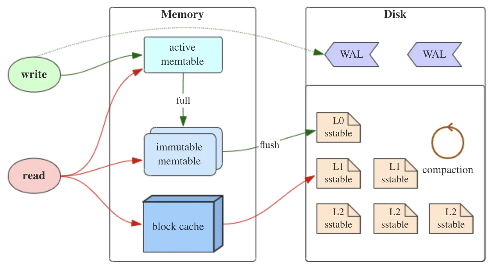
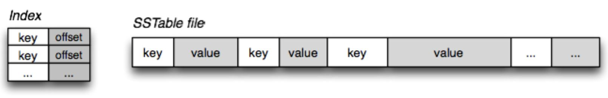

# lsm

### Introduction
A key/value db implemented by LSM. It is for studying LSM data structure.
I will design the db by the theories, and then compare with other famous
lsm databases. This README is writen before I write any code, because I 
can think through every detail before I start.

### What is LSM?
LSM is Log-Structured MergeTree. It is a data structure, but it's not a common
tree structure like B+ tree. Many popular databases are implemented by LSM.

The core concept of LSM is to use sequential IO to increase writing speed, 
so it has ___horizontal and vertical layers___ in its design. Because of layers,
it decreases reading speed. It is popular for More-Write-And-Less-Read situation.

### The LSM architecture (RocksDB)

There are different layers in the architecture of RocksDB.

1. MemTable: MemTable is an in-memory data structure, and it stores the recent data.
   All keys are in order by the data structure. It is not restricted to any data structure
   in this layer. For RocksDB, it is using skip list. Because it is in the memory,
   it will lose data for some situation. Therefore, it will use WAL(Write-ahead logging)
   for data durability. After a failure, it will read the WAL for the backup.
   
2. Immutable MemTable: When size of MemTable is increasing, it will turn into an 
   Immutable MemTable. Immutable is also in the memory, and it is a middle layer 
   between MemTable and SSTable. After the changing from MemTable, Immutable MemTable 
   will be read only and wait to be written to SSTable. All writing requests will 
   be processed by the new MemTable.
   
3. SSTable(Sorted String Table): This layer is in the disk. For the quick searching,
   it has key indexing and bloom filters(Check whether a key is in the SSTable). In the
   SSTable layer, it has many levels(l0, l1, l2...), also each level has many files to 
   store the logs. When there are too many files in the level, it will merge the files
   and next level files to decrease the file number in this level. It can happen for the
   cascade situation.
   
   
LSM keeps all logs in the memory, when the operations are getting large enough,
they will be flushed in the SSTable by sequential IO. LSM is log style data 
structure, and it saves all operations. It doesn't need to change the previous data
for faster sequential IO. In the contrast of B+ tree, it will always update the old
data by the new data. Therefore, B+ tree is an in-place update structure, and LSM is 
an out-place update structure. 

### Drawback of LSM
1. Read Amplification: Because LSM is log structured, it needs to read through,
   all layers and all levels to get a key. It can be solved by merging many SSTable
   files. In the same level of SSTable, it can ensure there is no duplicate log.
   Also, it can use the bloom filter to speed reading.

2. Size Amplification: LSM appends all logs to the disk, and it will not delete any 
   keys. It causes the garbage data in the disk. It also can be solved by the merging.
   After the merging, it will only keep the newest log for the same key.
   
3. Write Amplification: For solving read and size Amplification, it will have a background
   process to merge logs and compaction. For every merge, it repeated writing useless key by 
   multiple times. It causes write amplification. This problem can be solved by leveled
   compaction. It makes sure there is only one log of a key among the files in the SSTable level.
   There is no duplicate key log in the same level.

### Design of this project
Continue...

### Reference
[LSM Tree-Based engine](https://www.jianshu.com/p/e89cd503c9ae?utm_campaign=hugo)
[RocksDB](https://zhuanlan.zhihu.com/p/181498475)
